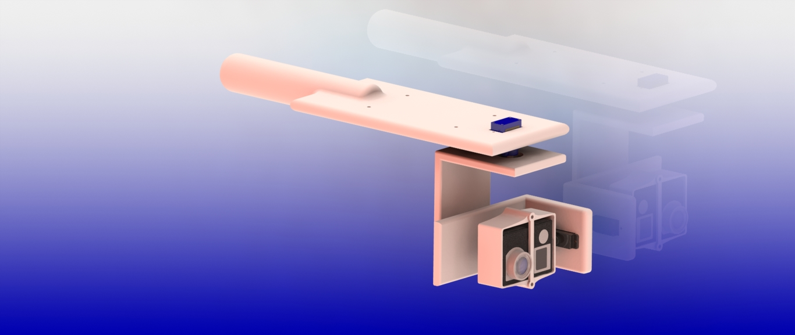

<!-- Badged -->

<!-- PROJECT LOGO -->
 

  

  <h3 align="center">Gimbal de 3 ejes</h3>

  

    El presente repositorio se corresponde con el proyecto integrador de la materia Informática II, correspondiente a la carrera en Ing. Electrónica de la Universidad Tecnológica Nacional - Facultad Regional de Buenos Aires. En este proyecto se desarrolló un estabilizador de cámara GoPro de tres ejes.

     
    <a href="https://github.com/lucasliano/Gimbal/blob/master/EntregaFinal/Gimbal%20Informe.pdf"><strong>Explore the docs »</strong></a>
     
     
    <a href="https://github.com/lucasliano/Gimbal/blob/master/Fotos">View Demo</a>
    ·
    <a href="https://github.com/lucasliano/Gimbal/issues">Report Bug</a>
    ·
    <a href="https://github.com/lucasliano/Gimbal/issues">Request Feature</a>
  

<!-- TABLE OF CONTENTS -->

  
<h2 style="display: inline-block">Table of Contents</h2>

  <ol>
    <<li>
      <a href="#about-the-project">About The Project</a>
      <ul>
        <li><a href="#authors">Authors</a></li>
        <li><a href="#images">Images</a></li>
      </ul>
    </li>
    <li><a href="#contributing">Contributing</a></li>
    <li><a href="#license">License</a></li>
    <li><a href="#contact">Contact</a></li>
  </ol>

<!-- ABOUT THE PROJECT -->
## About The Project

La idea fuerza del proyecto surgió gracias a las nuevas tecnologías utilizadas para la
transmisión de espectáculos en grandes espacios abiertos, tales como recitales o encuentros
deportivos en grandes estadios. El método utilizado inicialmente se basó en la utilización de cables
tensados y rieles en los cuales mediante un soporte, los elementos de filmación serían comandados
remotamente. Sin embargo, lejos de ser una solución, formuló un problema aún mayor; a una
determinada altura, los factores climáticos suponen un factor crítico a tener en cuenta que modifica la
precisión con la cual se puede manipular la herramienta de filmación.
Este inconveniente fue lo que motivó nuevos avances en materia de transmisiones. Referido
al problema inicial se propuso soportes acoplados en los extremos de las cámaras para poder
solventar el problema del viento y condiciones climáticas adversas.
A su vez, esta corriente tecnológica impulsó avances en la transmisión de deportes extremos
e individuales, para poder capturar experiencias que hasta el momento no podían ser alcanzadas. A
pesar de que no se trataba de deportes en los cuales la altura fuese un factor primordial, la velocidad,
los cambios bruscos de movimientos y repentinos presentaban el mismo problema descrito para
eventos masivos. La solución, sin embargo, esta vez fue diferente. Mediante la conjunción de
elementos que se detallarán a lo largo del documento, tanto en software y hardware, se logró el
elemento que nuestro proyecto intentará replicar, un estabilizador de cámara de tres ejes mediante
motores y algoritmos de control. Utilizaremos las cámaras para los cuales fueron diseñados
específicamente este elemento en primer lugar, las cuales pertenecen a la empresa goPro. En la
actualidad es posible utilizarlas en diferentes cámaras siempre y cuando se tenga en consideración el
peso y el tamaño de la cámara.

### Images

### Authors

* Coiro, Mateo
* Golob, Lautaro
* Liaño, Lucas
* Lovallo, Alejo
* Repetto, Facundo

<!-- CONTRIBUTING -->
## Contributing

Contributions are what make the open source community such an amazing place to be learn, inspire, and create. Any contributions you make are **greatly appreciated**.

1. Fork the Project
2. Create your Feature Branch (`git checkout -b feature/AmazingFeature`)
3. Commit your Changes (`git commit -m 'Add some AmazingFeature'`)
4. Push to the Branch (`git push origin feature/AmazingFeature`)
5. Open a Pull Request

<!-- LICENSE -->
## License

Distributed under the MIT License. See `LICENSE` for more information.

<!-- CONTACT -->
## Contact

Lucas Liaño - lliano@frba.utn.edu.ar

Project Link: [https://github.com/lucasliano/Gimbal](https://github.com/lucasliano/Gimbal)
